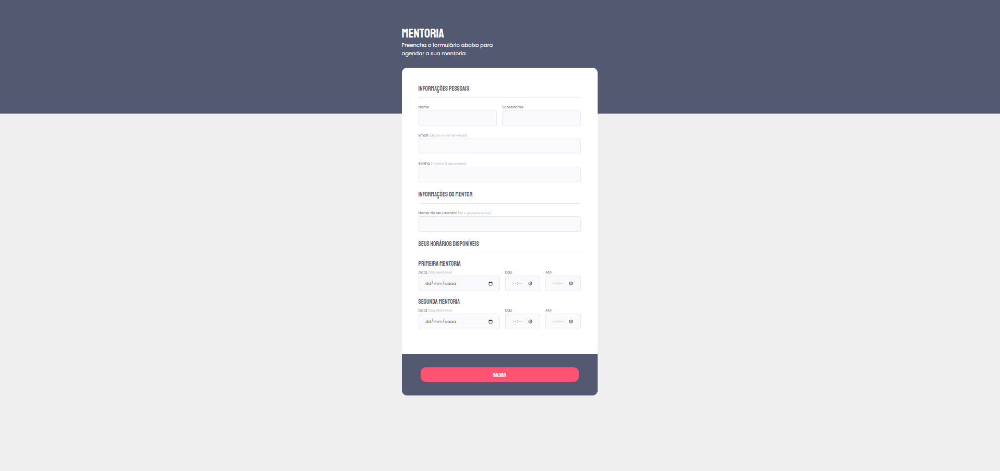

<h1 align="center">Formulário de Mentoria</h1>
<h3> Formulário de mentoria desenvolvido no Explorer Rocketseat</h3>

## Descrição do Projeto

Esse Projeto é o Front-end de um desafio proposto para consolidação do conhecimento adquirido no explorer da Rocketseat.

## Instalação

Basta baixar o repositório na sua máquina, abrir na IDE de sua preferência e executar o arquivo HTML em seu navegador.

## Funcionalidades

- Inserir informações do aluno.
- Limite de caracteres.

## Licença

MIT License.
Copyright (c) 2022.

## 🚀 Tecnologias Utilizadas

